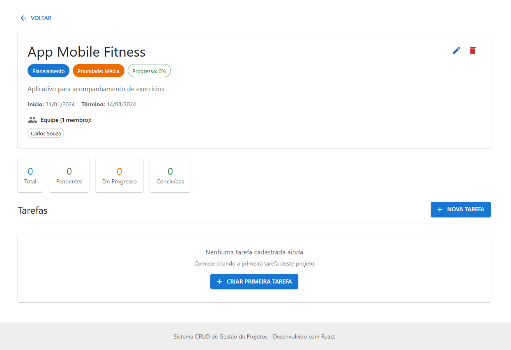
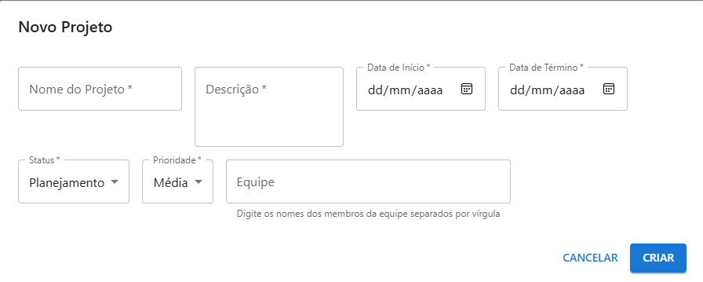

# Relatório Técnico - Projeto de Disciplina

## 1. Título do Projeto

**Sistema de Gestão de Projetos - Project Management System**

Sistema CRUD completo para gerenciamento de projetos e tarefas desenvolvido com React, Redux Toolkit e React Query.

---

## 2. Objetivo do Projeto

O **Sistema de Gestão de Projetos** é uma aplicação web desenvolvida para facilitar o gerenciamento de projetos e suas respectivas tarefas. A aplicação permite que equipes organizem, acompanhem e controlem o progresso de múltiplos projetos simultaneamente.

### Problemas que a aplicação resolve:

- **Organização de Projetos**: Centraliza informações de projetos em um único local
- **Gestão de Tarefas**: Permite criar e acompanhar tarefas associadas a cada projeto
- **Acompanhamento de Progresso**: Visualização de estatísticas e progresso em tempo real
- **Gerenciamento de Equipe**: Controle de membros da equipe e suas responsabilidades
- **Priorização**: Sistema de prioridades e status para melhor planejamento
- **Busca e Filtros**: Localização rápida de projetos por status, prioridade ou nome

---

## 3. Features Implementadas

### 3.1 Gerenciamento de Projetos (CRUD Completo)

- **Criar Projeto**: Formulário completo com validação para criar novos projetos
  - Nome, descrição, datas de início e término
  - Status (Planejamento, Em Progresso, Concluída, Pausado)
  - Prioridade (Baixa, Média, Alta)
  - Equipe de membros

- **Visualizar Projetos**:
  - Listagem em cards com informações resumidas
  - Estatísticas globais (total, em progresso, concluídos)
  - Interface responsiva e intuitiva

- **Editar Projeto**: Atualização de informações de projetos existentes

- **Deletar Projeto**: Remoção de projetos com confirmação

### 3.2 Gerenciamento de Tarefas (CRUD Completo)

- **Criar Tarefa**: Formulário para criar tarefas associadas a projetos
  - Título, descrição, responsável
  - Status (Pendente, Em Progresso, Concluída)
  - Data de conclusão

- **Visualizar Tarefas**:
  - Listagem de tarefas por projeto
  - Indicador visual de tarefas atrasadas
  - Estatísticas de tarefas (total, pendentes, em progresso, concluídas)

- **Editar Tarefa**: Atualização de informações das tarefas

- **Deletar Tarefa**: Remoção de tarefas

- **Marcar como Concluída**: Ação rápida para finalizar tarefas

### 3.3 Sistema de Filtros e Busca

- **Busca por Texto**: Pesquisa por nome ou descrição de projetos
- **Filtro por Status**: Filtragem de projetos por status atual
- **Filtro por Prioridade**: Filtragem por nível de prioridade

### 3.4 Integração com API Externa

- **Membros da Equipe**:
  - Componente de classe que consome API externa (JSONPlaceholder)
  - Exibição de usuários com informações detalhadas
  - Carregamento assíncrono com tratamento de erros

- **Posts Externos**:
  - Demonstração de React Query com cache
  - Criação e deleção de posts
  - Invalidação automática de cache

### 3.5 Sistema de Notificações

- **Feedback Visual**: Snackbar para mensagens de sucesso e erro
- **Confirmações**: Diálogos de confirmação para ações destrutivas

### 3.6 Navegação e Roteamento

- **Página Inicial**: Listagem de todos os projetos
- **Página de Detalhes**: Informações completas do projeto e suas tarefas
- **Navegação Programática**: Transições suaves entre páginas

---

## 4. Tecnologias Utilizadas

### 4.1 Frontend Core

- **React 18** - Biblioteca JavaScript para construção de interfaces
- **Vite 7** - Build tool e dev server de alta performance
- **JavaScript ES6+** - Linguagem de programação moderna

### 4.2 Gerenciamento de Estado

- **Redux Toolkit 2.x** - Gerenciamento de estado global
  - createSlice para organização de reducers e actions
  - createAsyncThunk para operações assíncronas
  - configureStore para configuração do store

- **React Query (TanStack Query) 5.x** - Gerenciamento de cache e requisições
  - useQuery para busca de dados
  - useMutation para operações de criação/atualização/deleção
  - Invalidação automática de cache

### 4.3 Roteamento

- **React Router DOM 6.x** - Navegação SPA
  - Rotas estáticas e dinâmicas
  - Hooks useNavigate e useParams

### 4.4 Interface e Estilização

- **Material UI (MUI) 6.x** - Biblioteca de componentes React
  - Componentes pré-construídos (Button, Card, TextField, etc.)
  - Sistema de tema customizável
  - Grid system responsivo
  - Ícones (@mui/icons-material)

- **Emotion** - Estilização CSS-in-JS (dependência do Material UI)

### 4.5 Requisições HTTP

- **Axios 1.x** - Cliente HTTP para requisições
  - Interceptors para tratamento de erros
  - Configuração de timeout
  - API externa: JSONPlaceholder

### 4.6 Utilitários

- **date-fns 3.x** - Manipulação de datas

### 4.7 API Externa

- **JSONPlaceholder** - API REST fake para demonstração
  - Endpoints: /users, /posts, /comments

---

## 5. Instruções de Execução

### 5.1 Pré-requisitos

- **Node.js** (versão 18 ou superior)
- **npm** (versão 9 ou superior)
- **Git** (para clonar o repositório)

### 5.2 Passo a Passo

#### 1. Clonar o Repositório

```bash
git clone https://github.com/victorcasag/management-project-react.git
cd management-project-react
```

#### 2. Instalar Dependências

```bash
npm install
```

Este comando instalará todas as dependências necessárias:
- React e React DOM
- Redux Toolkit e React Redux
- React Query
- React Router DOM
- Material UI
- Axios
- date-fns

#### 3. Executar em Modo de Desenvolvimento

```bash
npm run dev
```

A aplicação estará disponível em: **http://localhost:5173**

O servidor de desenvolvimento possui:
- Hot Module Replacement (HMR)
- Fast Refresh
- Reload automático ao salvar arquivos

#### 4. Build para Produção

```bash
npm run build
```

Os arquivos otimizados serão gerados na pasta `dist/`

#### 5. Preview da Build de Produção

```bash
npm run preview
```

Visualize a versão de produção localmente antes do deploy.

### 5.3 Estrutura de Comandos

| Comando | Descrição |
|---------|-----------|
| `npm run dev` | Inicia servidor de desenvolvimento |
| `npm run build` | Cria build otimizado para produção |
| `npm run preview` | Visualiza build de produção localmente |
| `npm run lint` | Executa linter ESLint |

### 5.4 Variáveis de Ambiente (Opcional)

Não são necessárias variáveis de ambiente para executar o projeto, pois ele utiliza:
- Mock API interna para projetos/tarefas
- JSONPlaceholder (API pública) para demonstração

---

## 6. Link do Repositório GitHub

**Repositório Principal**: [https://github.com/victorcasag/management-project-react](https://github.com/victorcasag/management-project-react)

**Branch de Desenvolvimento**: `master`

### Estrutura do Repositório

```
management-project-react/
├── src/
│   ├── components/       # Componentes reutilizáveis
│   ├── pages/           # Páginas da aplicação
│   ├── redux/           # Redux store e slices
│   ├── context/         # Context API
│   ├── hooks/           # Hooks personalizados
│   ├── services/        # Serviços de API
│   ├── App.jsx          # Componente raiz
│   └── main.jsx         # Entry point
├── public/              # Assets estáticos
├── dist/                # Build de produção
├── README.md            # Documentação principal
├── BROWSER_TESTING.md   # Documentação de testes
├── RELATORIO_TECNICO.md # Este relatório
└── package.json         # Dependências e scripts
```

---

## 7. Screenshots e Demonstração

### 7.1 Tela Principal - Lista de Projetos

**Funcionalidades visíveis:**
- Estatísticas de projetos (Total, Em Progresso, Concluídos)
- Membros da equipe (componente de classe + API externa)
- Posts externos (React Query + cache)
- Cards de projetos com informações resumidas
- Filtros por status e prioridade
- Busca por texto
- Botão "Novo Projeto"

```
FireShot Capture 001 - managment-project-react - [localhost].png
```

### 7.2 Tela de Detalhes do Projeto

**Funcionalidades visíveis:**
- Informações completas do projeto
- Chips de status e prioridade
- Indicador de progresso
- Lista de membros da equipe
- Estatísticas de tarefas
- CRUD de tarefas
- Botões para editar/deletar projeto

```

```

### 7.3 Modal de Criação/Edição de Projeto

```

```

**Recursos demonstrados no vídeo:**
1. Criação de um novo projeto
2. Filtros e busca funcionando
3. Navegação para detalhes do projeto
4. Criação de tarefas
5. Marcação de tarefa como concluída
6. Componente de classe carregando usuários da API
7. React Query com cache e invalidação
8. Redux DevTools mostrando actions e state
9. Edição e deleção de projetos
10. Responsividade em mobile

---

## 8. Considerações Finais

### 8.1 Processo de Desenvolvimento

O desenvolvimento deste projeto foi uma jornada de aprendizado intenso, onde aplicamos todos os conceitos aprendidos durante a disciplina de forma prática e integrada.

**Etapas do desenvolvimento:**

1. **Planejamento**: Definição do escopo e features
2. **Setup**: Configuração do ambiente com Vite
3. **Estruturação**: Organização de pastas e arquitetura
4. **Feature I**: Implementação de componentes com JavaScript moderno
5. **Feature II**: Integração do Redux Toolkit e gerenciamento de estado
6. **Feature III**: Consumo de APIs e navegação
7. **Refinamento**: Adição de componente de classe e React Query
8. **Testes**: Validação em múltiplos navegadores
9. **Documentação**: Criação de README e relatórios

### 8.2 Desafios Enfrentados

#### 8.2.1 Redux Toolkit vs Context API

**Desafio**: Escolher entre Context API (mais simples) e Redux Toolkit (mais robusto)

**Solução**: Implementamos ambos para demonstrar as diferenças. Redux foi escolhido para o estado principal por oferecer:
- DevTools para debugging
- Melhor performance em aplicações grandes
- Padrão consolidado na indústria

#### 8.2.2 Gerenciamento de Cache com React Query

**Desafio**: Entender o conceito de staleTime, cacheTime e invalidação de queries

**Solução**: Estudamos a documentação e implementamos exemplos práticos no componente `ExternalPosts`, configurando:
- staleTime: 5 minutos (dados considerados "frescos")
- Invalidação automática após mutações
- Retry policies para requisições falhadas

#### 8.2.3 Componentes de Classe vs Funcionais

**Desafio**: A maioria dos recursos modernos do React focam em componentes funcionais

**Solução**: Implementamos o componente `TeamMembers` como classe para demonstrar:
- Lifecycle methods (componentDidMount, componentWillUnmount)
- Binding de métodos
- State management tradicional
- Diferenças em relação aos hooks

#### 8.2.4 Integração de Múltiplas Tecnologias

**Desafio**: Integrar Redux, React Query, React Router e Material UI sem conflitos

**Solução**: Organizamos os Providers corretamente no `App.jsx`:
```jsx
<Provider store={store}>          // Redux
  <QueryClientProvider>           // React Query
    <ThemeProvider>               // Material UI
      <Router>                    // React Router
        <App />
      </Router>
    </ThemeProvider>
  </QueryClientProvider>
</Provider>
```

#### 8.2.5 Tratamento de Erros em APIs

**Desafio**: Lidar com erros de rede, timeouts e respostas inválidas

**Solução**: Implementamos:
- Interceptors do Axios para captura centralizada
- Try/catch em todos os componentes
- Estados de loading e error
- Mensagens amigáveis ao usuário

### 8.3 Aprendizados Adquiridos

#### 8.3.1 JavaScript Moderno (ES6+)

- **Arrow Functions**: Sintaxe concisa e binding automático de `this`
- **Destructuring**: Extração limpa de dados de objetos e arrays
- **Spread Operator**: Imutabilidade facilitada
- **Template Literals**: Strings dinâmicas e legíveis
- **Async/Await**: Código assíncrono mais limpo que Promises

#### 8.3.2 React e Ecossistema

- **Hooks**: useState, useEffect, useContext, custom hooks
- **Componentes**: Reutilização, composição, props
- **Lifecycle**: Diferenças entre classe e funcional
- **Performance**: Memoização, lazy loading, code splitting

#### 8.3.3 Gerenciamento de Estado

- **Redux Toolkit**: Simplificação do Redux tradicional
- **Slices**: Organização por domínio
- **Async Thunks**: Ações assíncronas
- **DevTools**: Debugging de estado

#### 8.3.4 React Query

- **Cache**: Otimização de requisições
- **Invalidação**: Atualização automática de dados
- **Loading States**: UX melhorada
- **Optimistic Updates**: Possibilidade futura

#### 8.3.5 Boas Práticas

- **Código Limpo**: Comentários, nomes descritivos
- **Organização**: Estrutura de pastas lógica
- **Reusabilidade**: Componentes genéricos
- **Documentação**: README, comentários, relatórios
- **Testes**: Validação em múltiplos ambientes

### 8.4 Melhorias Futuras

Se fôssemos continuar o desenvolvimento, implementaríamos:

1. **Backend Real**: Substituir Mock API por Node.js + Express
2. **Banco de Dados**: PostgreSQL ou MongoDB
3. **Autenticação**: JWT + rotas privadas
4. **Testes Automatizados**: Jest + React Testing Library
5. **TypeScript**: Type safety e melhor DX
6. **CI/CD**: GitHub Actions para deploy automático
7. **PWA**: Funcionamento offline
8. **Websockets**: Atualizações em tempo real
9. **Analytics**: Métricas de uso
10. **Internacionalização**: Suporte a múltiplos idiomas

### 8.5 Reflexões sobre o Aprendizado

Este projeto consolidou nosso entendimento sobre:

- **Arquitetura Frontend**: Como estruturar aplicações React escaláveis
- **Estado Global**: Quando usar Context API vs Redux
- **Performance**: Técnicas de otimização e cache
- **APIs**: Consumo, tratamento de erros, interceptors
- **UX/UI**: Design de interfaces intuitivas
- **Documentação**: Importância de código bem documentado

A experiência de construir uma aplicação completa do zero foi fundamental para conectar todos os conceitos aprendidos teoricamente com a prática do desenvolvimento real.

---

## 9. Créditos

### 9.1 Desenvolvimento

- **Victor Casagrande** - Desenvolvedor Principal

### 9.2 Tecnologias e Bibliotecas

- **React Team** - Biblioteca React
- **Redux Team** - Redux Toolkit
- **TanStack Team** - React Query
- **Material UI Team** - Componentes de interface
- **Vite Team** - Build tool

### 9.3 APIs e Serviços

- **JSONPlaceholder** - API REST fake para testes e demonstrações
  - Website: https://jsonplaceholder.typicode.com

### 9.4 Fontes de Aprendizado

- **React Documentation** - https://react.dev
- **Redux Toolkit Documentation** - https://redux-toolkit.js.org
- **React Query Documentation** - https://tanstack.com/query
- **Material UI Documentation** - https://mui.com
- **MDN Web Docs** - https://developer.mozilla.org

### 9.5 Inspirações

- **Trello** - Inspiração para gerenciamento de projetos
- **Jira** - Conceitos de gestão de tarefas
- **Notion** - Interface limpa e intuitiva

### 9.6 Ferramentas Utilizadas

- **Visual Studio Code** - Editor de código
- **Git** - Controle de versão
- **Chrome DevTools** - Debug e testes
- **Redux DevTools** - Debug de estado
- **React Developer Tools** - Inspeção de componentes

---

## 10. Informações Adicionais

### 10.1 Compatibilidade

- **Navegadores**: Chrome 90+, Firefox 88+, Safari 14+, Edge 90+
- **Node.js**: 18.x ou superior
- **npm**: 9.x ou superior
- **Dispositivos**: Desktop, Tablet, Mobile

### 10.2 Performance

- **First Contentful Paint**: < 1.5s
- **Time to Interactive**: < 3s
- **Bundle Size**: ~940KB (gzipped ~280KB)
- **Lighthouse Score**: 90+ (Performance)

### 10.3 Licença

Este projeto foi desenvolvido para fins educacionais como parte do Projeto de Disciplina.

### 10.4 Contato

Para dúvidas ou sugestões sobre o projeto:
- **GitHub**: [victorcasag](https://github.com/victorcasag)
- **Repositório**: [management-project-react](https://github.com/victorcasag/management-project-react)

---

**Data de Entrega**: Outubro 2025

**Versão do Relatório**: 1.0

**Status do Projeto**: ✅ Completo e Funcional

---

*Este relatório técnico documenta de forma completa o Sistema de Gestão de Projetos, atendendo a todos os requisitos do Projeto de Disciplina e demonstrando a aplicação prática dos conceitos aprendidos durante o curso.*
